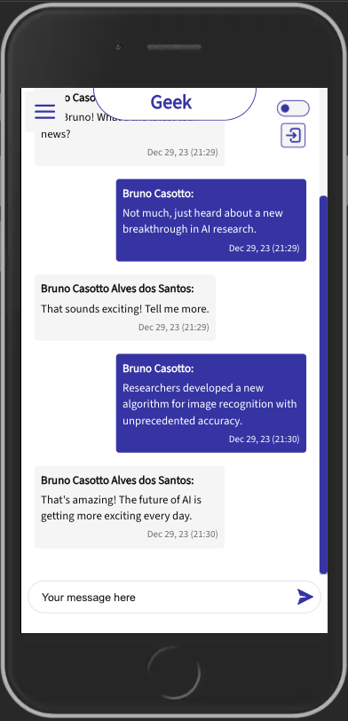

# Web Chat

Um chat desenvolvido para web onde é possível trocar mensagens em tempo real com diversos usuários autenticados (Google Auth).

## Tecnologias
Para o desenvolvimento desse projeto foi utilizado:

[Vue3](https://vuejs.org/guide/introduction.html)

[Firebase Realtime Database](https://firebase.google.com/docs/database?hl=pt-br)

[Firebase Hosting](https://firebase.google.com/docs/hosting?hl=pt-br)

[Google Auth](https://developers.google.com/identity/sign-in/web/sign-in?hl=pt-br)

[Scss](https://sass-lang.com/)

## Apresentação
Com esse projeto é possível:
* Se auteticar utilizando o Gmail atraves da integração com o google auth
* Navegar por chats cadastrados previamente no firebase
* Enviar e receber mensagens de todos usuários que estão com o chat ativo (realtime database)
* Alternar o tema claro/escuro

## Print Screens
Esse projeto está disponível em: https://casotto-web-chat.firebaseapp.com/



## Dev
Para rodar o projeto local:
```
   $ npm install
   $ npm run dev
```

## IDE recomendada

- [VS Code](https://code.visualstudio.com/) + [Volar](https://marketplace.visualstudio.com/items?itemName=Vue.volar) (and disable Vetur) + [TypeScript Vue Plugin (Volar)](https://marketplace.visualstudio.com/items?itemName=Vue.vscode-typescript-vue-plugin).

