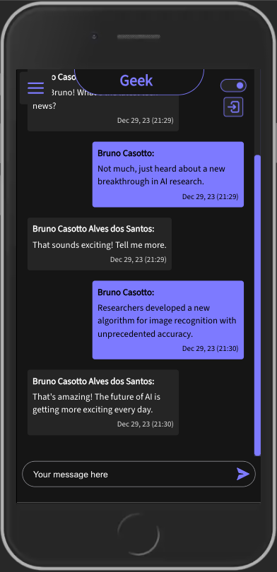

# Web Chat

A chat application developed for the web where users can exchange real-time messages, authenticated through Google Auth.

## Technologies
The development of this project involved the use of:

[Vue3](https://vuejs.org/guide/introduction.html)

[Firebase Realtime Database](https://firebase.google.com/docs/database?hl=en)

[Firebase Hosting](https://firebase.google.com/docs/hosting?hl=en)

[Google Auth](https://developers.google.com/identity/sign-in/web/sign-in?hl=en)

[Scss](https://sass-lang.com/)

## Presentation
With this project, you can:
* Authenticate using Gmail through integration with Google Auth
* Navigate through chats previously registered in Firebase
* Send and receive messages from all users with an active chat (realtime database)
* Switch between light/dark themes

## Screenshots
This project is available at: https://casotto-web-chat.firebaseapp.com/



## Dev
To run the project locally:
```bash
   $ npm install
   $ npm run dev
```

## Recommended IDE

- [VS Code](https://code.visualstudio.com/) + [Volar](https://marketplace.visualstudio.com/items?itemName=Vue.volar) (and disable Vetur) + [TypeScript Vue Plugin (Volar)](https://marketplace.visualstudio.com/items?itemName=Vue.vscode-typescript-vue-plugin).
